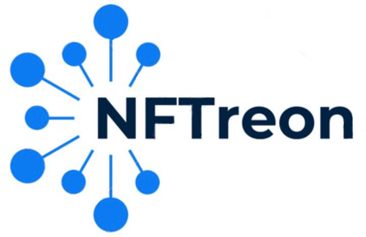

# Introducing NFTreon
NFTreon emerges as a cutting-edge web3 platform anchored on the powerful Flare blockchain, tailored for enthusiasts of unparalleled digital content. It not only reimagines content access by moving away from traditional subscription models but also introduces a transformative approach where memberships are synonymous with the acquisition of NFTs (Non-Fungible Tokens).

Seamlessly blended with the Flare ecosystem, NFTreon guarantees a fluid, secure, and prompt transactional experience. Each NFT serves a multifaceted role: it grants its possessor access to a meticulously curated library of content and stands as a digital collectible. But the innovation doesn't stop here. These tokens are not mere access tools; they represent tangible investments in creators. As a user, when you purchase an NFT, you're staking a claim in the future of that creator. Over time, as creators grow in prominence, these NFTs can be sold to other users eager to access the creator's expanding content vault, potentially offering lucrative returns on initial investments.

In a world where the boundaries of entertainment, blockchain technology, and digital artistry merge, NFTreon is positioned at the epicenter. It promises users an unmatched blend of exclusivity, true ownership, immersive engagement, and a unique investment avenue. Embark on a journey with NFTreon, where every token purchased is both an entry ticket and an investment seed, sprouting possibilities for the future.
## Table of Contents  
- [Getting Started](#getting-started) 
	- [Installation](#installation) 
	- [Overview](#overview) 
- [Contributors](#contributors) 

## Getting Started  
### Installation 
- `git clone https://github.com/CoderEren/NFTreon master`
- `cd NFTreon`
- `npm install react ethers` 
- `npm start`

### Overview
   - **Description**: This function is run when the user connects their wallet for the first time. It sets their username, number of NFTs they want to offer, and at which price. It has security checks, such as checking if the username already exists, and checks if the user is creating more than one profile. In these cases, the transaction will be reverted. 
   - **Technical**: 
```solidity	 
function setProfile(string memory username, uint256 noOfMembers, uint256 _floorPrice) public {
	require(checkUsernameExists(username) == false, "This username already exists!");
	require(walletToCreator[msg.sender].noOfNFTs == 0, "You can't create multiple profiles!");
	usernameToWallet[username] = msg.sender;
	noOfCreators += 1;
	Creator storage creator = walletToCreator[msg.sender];
	creator.noOfNFTs = noOfMembers;
	creator.floorPrice = _floorPrice;
	creator.noOfHolders = 0;
}
```
  - **Description**: This function checks if the user holds the NFT of the creator. If the function returns true, then the content of the creator will be displayed on the website. 
	- **Technical**: 

			 ```solidity
			 function checkIfHoldingNFT(string memory username) public view returns(bool) {
		        Creator storage creator = walletToCreator[usernameToWallet[username]];
		        if (creator.sellingNFTForPrice[msg.sender] != 0) {
		            return true;
		        } else {
		            return creator.holdingNFT[msg.sender];
		        }
		    }
			```
	- **Description**: This function lets the user purchase an NFT from the creator at the floor price. It has security checks in place, such as checking whether or not the user already owns an NFT, checking if the amount paid is equal to the floor price, and checking if all NFTs are sold out. 
	- **Technical**: 

			 ```solidity
			 function buyNFTForFloorPrice(string memory username) public payable {
		        require(checkIfHoldingNFT(username) == false, "You already own an NFT of this creator!");
		        Creator storage creator = walletToCreator[usernameToWallet[username]];
		        require(msg.value >= creator.floorPrice, "You must pay the exact price or higher!");
		        require(creator.noOfHolders < creator.noOfNFTs, "All NFTs are sold out! You can only buy them from another user who wants to sell it for higher.");
		        //send money to NFT seller
		        (bool sent, bytes memory data) = usernameToWallet[username].call{value: msg.value * (100 - commission) / 100}("");
		        require(sent, "Failed to send Ether to seller");
		        //send commissions to the smart contract
		        (bool sent2, bytes memory data2) = admin.call{value: msg.value * commission / 100}("");
		        require(sent2, "Failed to send Ether to the smart contract");
		        //add ownership of NFT
		        creator.noOfHolders += 1;
		        creator.holdingNFT[msg.sender] = true;
		    }
			```
	- **Description**: This function lets the user buy an NFT from another user that had offered their NFT for sale. For each sale of an NFT, the platform will earn a 5% commission, the creator will earn a 10% commission, and the seller earns the rest. After security checks, the ownership of the NFT will be changed from the seller to the buyer. 
	- **Technical**: 

			 ```solidity
			     function buyNFTFromAnotherUser(string memory username, address seller) public payable {
			        require(checkIfHoldingNFT(username) == false, "You already own an NFT of this creator!");
			        Creator storage creator = walletToCreator[usernameToWallet[username]];
			        require(msg.value >= creator.sellingNFTForPrice[seller], "You must pay the exact price or higher!");
			        require(creator.sellingNFTForPrice[seller] > 0, "That user is not selling their NFT!");
			        //send money to NFT seller
			        (bool sent, bytes memory data) = seller.call{value: msg.value * (100 - commission - creatorCommission) / 100}("");
			        require(sent, "Failed to send Ether to seller");
			        //send commissions to the smart contract
			        (bool sent2, bytes memory data2) = admin.call{value: msg.value * commission / 100}("");
			        require(sent2, "Failed to send Ether to the smart contract");
			        //send commissions to the creator
			        (bool sent3, bytes memory data3) = usernameToWallet[username].call{value: msg.value * creatorCommission / 100}("");
			        require(sent3, "Failed to send Ether to seller");
			        //change ownership of the NFT
			        creator.holdingNFT[seller] = false;
			        creator.holdingNFT[msg.sender] = true;
			        creator.sellingNFTForPrice[seller] = 0;
			        for (uint i = 0; i < creator.sellers.length; i++) {
			            if (creator.sellers[i] == seller) {
			                delete creator.sellers[i];
			            }
			        }
			    }
			```
	- **Description**: This function lets a user offer their NFT for sale at a price that they determine. There is a security check in place to make sure that the user must own an NFT of that creator. It also adds users who want to sell their NFTs to an array named sellers, such that all sellers and the their asking price will be displayed on the website. 
	- **Technical**: 

			 ```solidity
			     function offerNFTForSale(string memory username, uint256 price) public {
			        require(checkIfHoldingNFT(username) == true, "You must own an NFT of the creator first!");
			        Creator storage creator = walletToCreator[usernameToWallet[username]];
			        creator.sellingNFTForPrice[msg.sender] = price;
			        creator.sellers.push(msg.sender);
			    }
			```
### Images of the Demo


    
## Contributors
The project was masterfully conceptualized and brought to life by a gifted team comprising `Cindy Yun`, `Ryan Fok`, `Caleb Kan`, `Leo Ip`, `Eren Geridonmez`, and `Wesley Sze`. Designed specifically as an entry for the ETH London Hackathon, the team targeted the Flare Bounty track. Their innovation and dedication showcased throughout the event epitomized the team's collective skills and passion.
